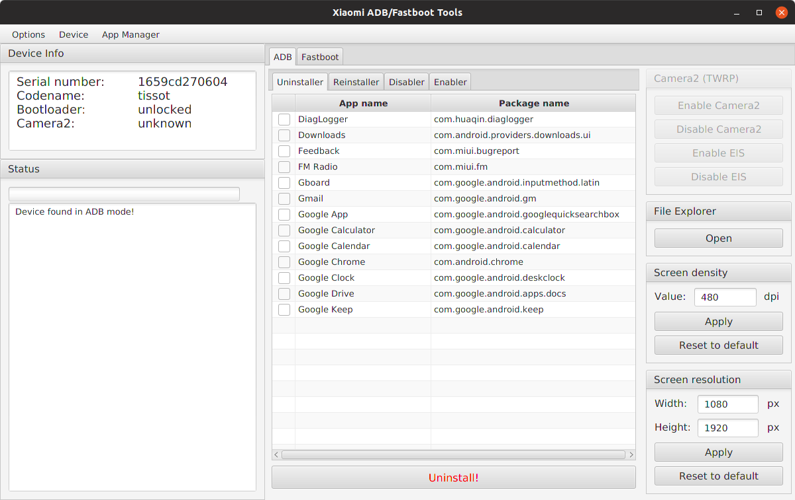

# Xiaomi ADB/Fastboot Tools

A JavaFX desktop front-end for `adb` and `fastboot`, aimed at Xiaomi devices: uninstall or
disable system apps, browse device storage, override DPI and resolution, read device
properties, flash partitions and reboot into any mode.



## Provenance

The upstream project (`Szaki/XiaomiADBFastbootTools`) was deleted from GitHub. The sources
here come from the last surviving fork, `op07n/XiaomiADBFastbootTools` (April 2020), and
keep its MIT license. What changed since:

- The build runs on a current JDK again — Gradle 9, Kotlin 2, JavaFX 21. Gradle 6.3 could
  not start on anything past JDK 20, which blocked every other change.
- The app lists **every** package the device reports. It used to walk a hand-curated
  `apps.yml` from 2020 and show only what that file already knew, which on HyperOS is a
  small fraction of what is installed. `apps.yml` is now a source of readable names and of
  the Vetted column; anything missing from it appears under its package name, marked `no`.
- The update check is gone. It asked the deleted upstream repository for its latest release
  on every launch, so it could only ever fail.
- The `apps.yml` download from the deleted upstream repo is gone, so a run no longer waits
  on a request that can only fail.
- Data goes to `~/.local/xiaomi-adb-tools` instead of a directory in the home root,
  and JavaFX is told to unpack its native libraries there too rather than into `~/.openjfx`.

`adb` and `fastboot` are taken from `PATH` when they are there; only if they are missing
does the app download `platform-tools` into its own data directory.

## Building

Requires a JDK 21 or newer. `gradlew` is a wrapper, so no separate Gradle install:

```
./gradlew jar
```

The result is a self-contained `build/libs/XiaomiADBFastbootTools.jar` bundling JavaFX for
Windows, Linux and macOS on both x64 and aarch64. Run it with `java -jar`.

**Warning: use the program at your own risk.**

## Instructions

### Connecting a device in ADB mode

1. Enable developer options in Android.

    * MIUI: Go to Settings > About device and tap ‘MIUI version’ seven times to enable developer options.
    * Android One: Go to Settings > System > About device and tap ‘Build number’ seven times to enable developer options.

2. Enable USB debugging in Android.

    * MIUI: Go to Settings > Additional settings > Developer options and enable USB debugging.
        * In order to use the Screen density and Screen resolution modules, enable USB debugging (Security settings) as well.
    * Android One: Go to Settings > System > Developer options and enable USB debugging.

3. Connect your device to the computer and launch the application. The device is going to ask for authorisation, which you'll have to allow.

4. Wait for the application to detect your device. The device info should appear in the top left section.

### Connecting a device in Fastboot mode

1. Put your device into Fastboot mode by holding power and volume down simultaneously until the Fastboot splash screen comes up.

    * If your device is loaded in ADB mode, you can enter Fastboot mode by clicking Menu > Reboot device to Fastboot.

2. Connect your device to the computer and launch the application.

3. Wait for the application to detect your device. The device info should appear in the top left section.

## FAQ & Troubleshooting

**The application doesn't work. Is there anything I should have installed?**

Yes, the tool is written in Kotlin for the Java Virtual Machine, so it needs a JRE to run, version 21 or later.

Any current build works: Temurin, Oracle JDK or the `openjdk-21-jre` package of a Linux distribution.

**The app on Windows doesn't detect my device even though it's connected and USB debugging is enabled. What could be the issue?**

Windows most likely doesn't recognise your device in ADB mode. Install the universal ADB drivers from [here](http://dl.adbdriver.com/upload/adbdriver.zip), reboot your PC and try again.

**Do I need an unlocked bootloader or root access to use the app?**

The Flasher, Wiper and Camera2 modules in Fastboot mode require an unlocked bootloader but everything else works without rooting or unlocking.

**What apps are safe to uninstall?**

Upstream only listed apps it considered safe. This version lists everything installed on the
device, which is the point of the change but also removes that guard rail: the list now
includes packages the system needs, and uninstalling one of those can soft brick the device.

The **Vetted** column in the Uninstaller and Disabler is what replaces it. `yes` means the
package is on the curated list somebody checked; `no` means it came straight off the device
and nobody has vouched for it. Click the column header to sort, and look up anything marked
`no` before touching it. On a Redmi Note 10 Pro running MIUI 14 the split is 48 vetted rows
against 311 unvetted ones, so the column is doing real work.

**What's the difference between uninstalling and disabling?**

The OS sees which apps have been disabled and it can re-enable them whenever it pleases but it cannot do the same with uninstalled apps. Apps you disable may come back anytime and you can also re-enable them in the Settings, while uninstalled apps will only return if you reinstall them (using ADB or an APK) or factory reset the device. There's no difference when it comes to their impact on the system, however, functionality or performance wise, so uninstalling is the right call for apps that pose a security or privacy risk, and disabling is enough for everything else.

**Do uninstalled system apps affect OTA updates?**

No, you are free to install updates without the fear of bricking your device or losing data.

**Do uninstalled system apps come back with updates?**

No, uninstalled apps should only come back when you reinstall them or factory reset your device.

**Why does the Uninstaller hang on some apps?**

There are some apps Global MIUI doesn't let you uninstall but Chinese MIUI does. If you try to uninstall an app like that, the tool might hang. If that happens, close the tools, disconnect your device, uninstall the app manually, then launch the tools again and reconnect your device to proceed.

**How do I regain uninstalled system apps?**

Simply reinstall them using the Reinstaller module when connected in ADB mode. In case the Reinstaller module is disabled because your device doesn't support it, you must perform a factory reset.

**The app is called Xiaomi ADB/Fastboot Tools. Does that mean that it only works with Xiaomi devices?**

ADB and Fastboot are universal interfaces on Android but some of the algorithms and methods of the app are specific to Xiaomi devices, so mostly yes.

**Does this replace MiFlash or MiUnlock?**

No. Fastboot ROM flashing is available so MiFlash can mostly be replaced but implementing EDL flashing or bootloader unlocking on MIUI would only make the program unnecessarily complex.
